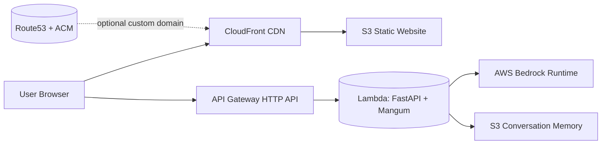
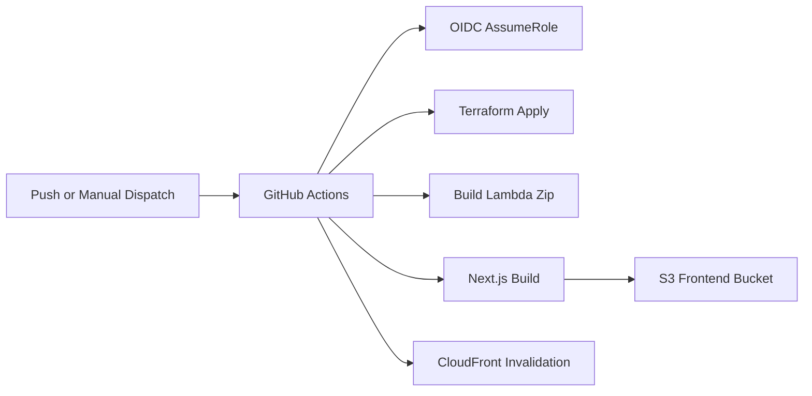

# LLMOps | Digital Twin
Terraform-first LLMOps digital twin that pairs a Next.js chat UI with a serverless FastAPI backend on AWS Bedrock. It includes CI/CD automation, remote Terraform state, and secure AWS OIDC auth so environments can be created and torn down consistently.

Benefits:
- Reproducible infra and app deployments across dev/test/prod
- Serverless footprint with pay-per-use costs
- Secure authentication with OIDC instead of long-lived keys
- Portable persona and memory storage in S3

## Digital Twin Demo

<div align="center">
  
</div>

## Quick Start
1) Install prerequisites:
   - AWS CLI (configured for an account with Bedrock access)
   - Terraform >= 1.0
   - Node.js 20+ (npm)
   - Python 3.12 + uv
   - Docker (used to build the Lambda package)

2) Authenticate to AWS:
```powershell
aws sts get-caller-identity
```

3) Deploy infrastructure + app:
```powershell
.\scripts\deploy.ps1 -Environment dev -ProjectName twin
```
Or bash:
```bash
./scripts/deploy.sh dev twin
```
This builds the Lambda package, applies Terraform with the S3/DynamoDB backend, builds the Next.js static site, uploads to S3, and invalidates CloudFront.

Tip: set `DEFAULT_AWS_REGION` if you do not want the default `us-east-1` region.

## Architecture Overview


## CI/CD Overview


## Tech Stack
- `Frontend`: Next.js 16 (App Router), React 19, Tailwind CSS, lucide-react, react-markdown
- `Backend`: FastAPI (Python 3.12), Mangum, boto3, uvicorn
- `LLM`: AWS Bedrock (model ID configurable via `bedrock_model_id`)
- `Infrastructure`: Terraform, GitHub Actions (OIDC), S3 + DynamoDB remote state
- `AWS Services`: S3, Lambda, API Gateway (HTTP API), CloudFront, Bedrock, IAM, optional Route53 + ACM

## Environments and State
- Environments use Terraform workspaces: dev, test, prod.
- Remote state uses S3 with a DynamoDB lock table (`twin-terraform-state-<account_id>`, `twin-terraform-locks`).
- Resource naming follows `<project_name>-<environment>-<service>-<account_id>`.

## Configuration
- `terraform/terraform.tfvars`: project name, environment, model ID, throttles, custom domain settings.
- `backend/.env`: local dev settings like `CORS_ORIGINS`, `USE_S3`, `S3_BUCKET`, `BEDROCK_MODEL_ID`.

## Project Structure
- `backend/`: FastAPI API, Bedrock integration, memory storage, Lambda packaging
- `frontend/`: Next.js chat UI (static build output deployed to S3)
- `terraform/`: AWS infrastructure (S3, Lambda, API Gateway, CloudFront, IAM, Route53/ACM)
- `scripts/`: Deploy and destroy automation for dev/test/prod
- `.github/workflows/`: GitHub Actions deploy and destroy workflows
- `img/demo/twin_demo.gif`: demo GIF (keep this in place)
- `memory/`: local memory store when `USE_S3=false`

## Deploy/Destroy Options
Deploy:
```powershell
.\scripts\deploy.ps1 -Environment dev -ProjectName twin
```
```bash
./scripts/deploy.sh dev twin
```

Destroy:
```powershell
.\scripts\destroy.ps1 -Environment dev -ProjectName twin
```
```bash
./scripts/destroy.sh dev twin
```

## CI/CD Secrets
GitHub Actions expects these repository secrets for OIDC deployments:
- `AWS_ROLE_ARN`
- `AWS_ACCOUNT_ID`
- `DEFAULT_AWS_REGION`

## Guides
See the component docs for deeper detail:
- `backend/README.md`
- `backend/data/README.md`
- `frontend/README.md`
