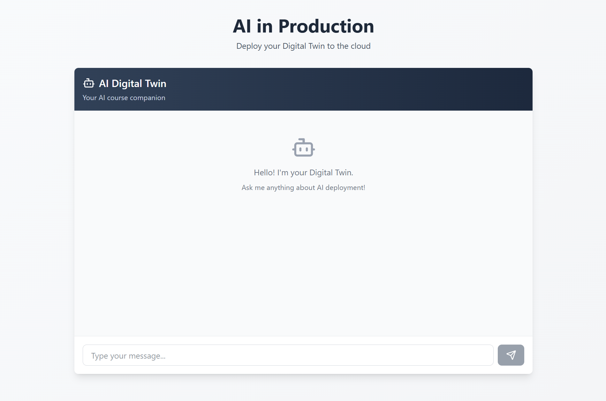
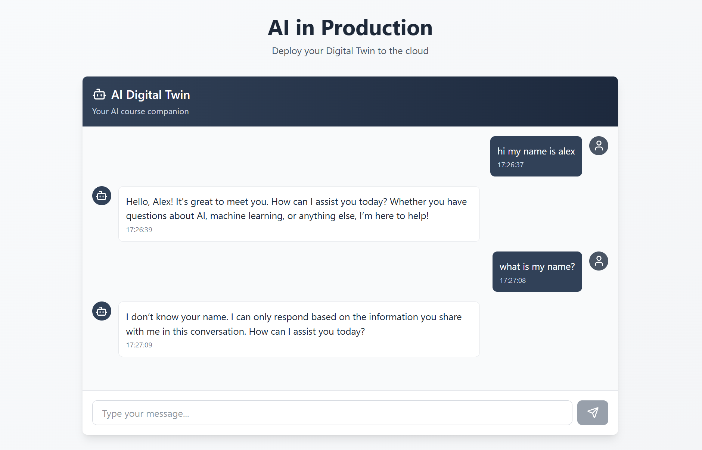

# 🧪 **Testing the Digital Twin (No Memory) — Branch Overview**

This branch focuses on running and testing the **llmops-digital-twin** application locally. At this stage, the backend does not yet include memory, so each message is processed independently. The goal is simply to verify that the backend and frontend communicate correctly, and to observe the limitation that the Digital Twin cannot remember anything yet.

## Part 1: start the backend server

### Step 1: Launch the backend

Open a new terminal in Cursor:

```bash
cd backend
uv run uvicorn server:app --reload
```

You should see something like:

```
INFO:     Uvicorn running on http://127.0.0.1:8000 (Press CTRL+C to quit)
INFO:     Started reloader process [...]
INFO:     Started server process [...]
INFO:     Waiting for application startup.
INFO:     Application startup complete.
INFO:     127.0.0.1 - "GET / HTTP/1.1" 200 OK
```

Click the URL. Your browser will show:

```
{"message":"AI Digital Twin API"}
```

This confirms the backend API is running correctly.

## Part 2: start the frontend interface

### Step 2: Launch the frontend development server

Open another new terminal:

```bash
cd frontend
npm run dev
```

You should see output similar to:

```
▲ Next.js 16.x (Turbopack)
- Local:   http://localhost:3000
- Network: http://192.168.x.x:3000
✓ Ready in 1.2s
```

Now open the app:

```
http://localhost:3000
```

You will see your Digital Twin interface:



## Part 3: observe the memory limitation

Try the following simple test conversation:

1. Go to `http://localhost:3000`
2. Interact with the Digital Twin:

   * **you:** “Hi! My name is Alex”
   * **twin:** greets you normally
   * **you:** “What’s my name?”
   * **twin:** does **not** remember it



This is expected behaviour.
Your backend currently processes every message independently:

* no stored conversation state
* no awareness of previous messages
* system prompt + single user message only

This stage exists specifically to demonstrate that **memory is missing** and must be implemented manually in the next branch.

Your backend and frontend are now fully connected and functioning, and you are ready to add memory support next.
