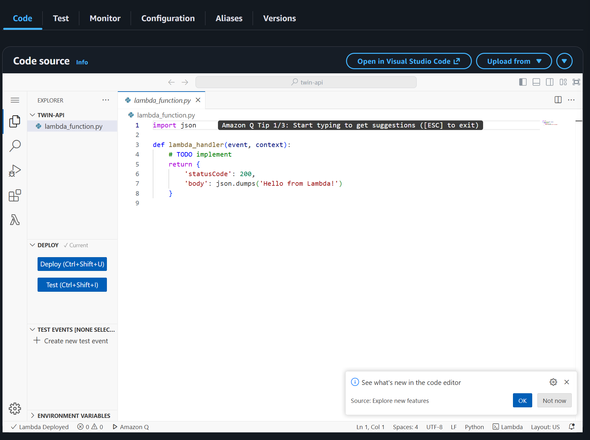
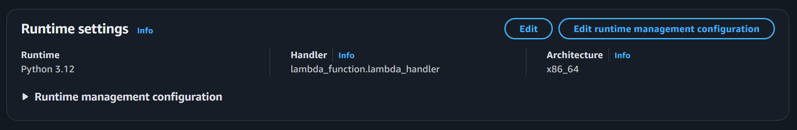
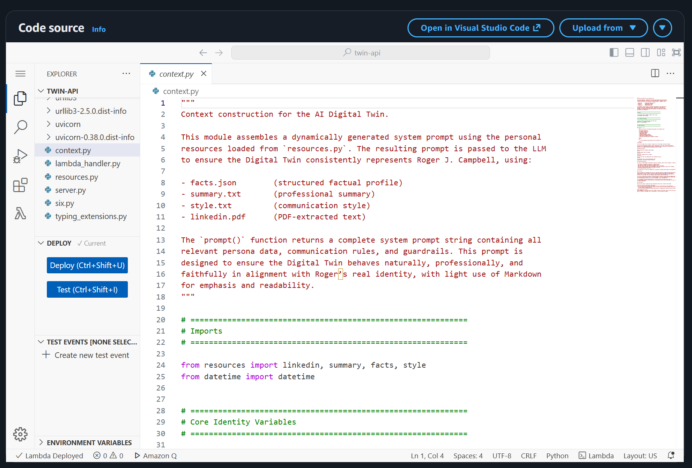
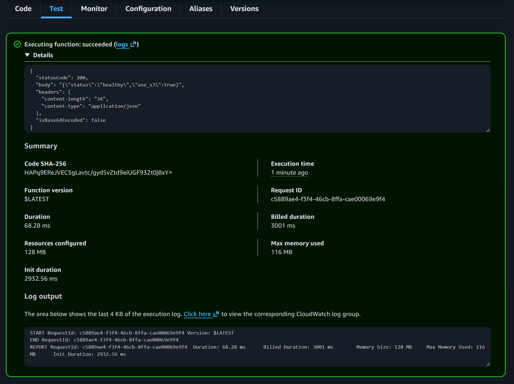

# ⚙️ AWS Lambda Packaging & Deployment

## Package Lambda Function

### Step 1: Create Deployment Script

Create `backend/deploy.py`:

```python
import os
import shutil
import zipfile
import subprocess


def main():
    print("Creating Lambda deployment package...")

    # Clean up
    if os.path.exists("lambda-package"):
        shutil.rmtree("lambda-package")
    if os.path.exists("lambda-deployment.zip"):
        os.remove("lambda-deployment.zip")

    # Create package directory
    os.makedirs("lambda-package")

    # Install dependencies using Docker with Lambda runtime image
    print("Installing dependencies for Lambda runtime...")

    # Use the official AWS Lambda Python 3.12 image
    # This ensures compatibility with Lambda's runtime environment
    subprocess.run(
        [
            "docker",
            "run",
            "--rm",
            "-v",
            f"{os.getcwd()}:/var/task",
            "--platform",
            "linux/amd64",  # Force x86_64 architecture
            "--entrypoint",
            "",  # Override the default entrypoint
            "public.ecr.aws/lambda/python:3.12",
            "/bin/sh",
            "-c",
            "pip install --target /var/task/lambda-package -r /var/task/requirements.txt --platform manylinux2014_x86_64 --only-binary=:all: --upgrade",
        ],
        check=True,
    )

    # Copy application files
    print("Copying application files...")
    for file in ["server.py", "lambda_handler.py", "context.py", "resources.py"]:
        if os.path.exists(file):
            shutil.copy2(file, "lambda-package/")
    
    # Copy data directory
    if os.path.exists("data"):
        shutil.copytree("data", "lambda-package/data")

    # Create zip
    print("Creating zip file...")
    with zipfile.ZipFile("lambda-deployment.zip", "w", zipfile.ZIP_DEFLATED) as zipf:
        for root, dirs, files in os.walk("lambda-package"):
            for file in files:
                file_path = os.path.join(root, file)
                arcname = os.path.relpath(file_path, "lambda-package")
                zipf.write(file_path, arcname)

    # Show package size
    size_mb = os.path.getsize("lambda-deployment.zip") / (1024 * 1024)
    print(f"✓ Created lambda-deployment.zip ({size_mb:.2f} MB)")


if __name__ == "__main__":
    main()
```

### Step 2: Update .gitignore

Add to your `.gitignore`:

```
lambda-deployment.zip
lambda-package/
```

### Step 3: Build the Lambda Package

Make sure Docker Desktop is running, then:

```bash
cd backend
uv run deploy.py
```

This creates `lambda-deployment.zip` containing your Lambda function and all dependencies.

If successful, you will see output similar to:

```
[notice] A new release of pip is available: 25.0.1 -> 25.3
[notice] To update, run: pip install --upgrade pip
📄 Copying backend source files...
   • Copied server.py
   • Copied lambda_handler.py
   • Copied context.py
   • Copied resources.py
📂 Copied data/ folder
📦 Creating zip file...
✅ Created lambda-deployment.zip (25.28 MB)
```

## Deploy Lambda Function

### Step 1: Create Lambda Function

1. In AWS Console, search for **Lambda**
2. Click **Create function**
3. Choose **Author from scratch**
4. Configuration:

   * Function name: `twin-api`
   * Runtime: **Python 3.12**
   * Architecture: **x86_64**
5. Click **Create function**

### Step 2: Upload Your Code

**Option A: Direct Upload (for fast connections)**

1. In the Lambda function page, under **Code source**



2. Click **Upload from** → **.zip file**
3. Select `backend/lambda-deployment.zip`
4. Click **Save**

**Option B: Upload via S3 (recommended for files >10MB or slow connections)**

1. Create a temporary S3 bucket:

**Mac/Linux:**

```bash
DEPLOY_BUCKET="twin-deploy-$(date +%s)"
aws s3 mb s3://$DEPLOY_BUCKET
aws s3 cp backend/lambda-deployment.zip s3://$DEPLOY_BUCKET/
echo "S3 URI: s3://$DEPLOY_BUCKET/lambda-deployment.zip"
```

**Windows (PowerShell):**

```powershell
$timestamp = Get-Date -Format "yyyyMMddHHmmss"
$deployBucket = "twin-deploy-$timestamp"
aws s3 mb s3://$deployBucket
aws s3 cp backend/lambda-deployment.zip s3://$deployBucket/
Write-Host "S3 URI: s3://$deployBucket/lambda-deployment.zip"
```

2. In the Lambda function page, under **Code source**

3. Click **Upload from** → **Amazon S3 location**

4. Enter your S3 URI

5. Click **Save**

6. Cleanup:

**Mac/Linux:**

```bash
aws s3 rm s3://$DEPLOY_BUCKET/lambda-deployment.zip
aws s3 rb s3://$DEPLOY_BUCKET
```

**Windows (PowerShell):**

```powershell
aws s3 rm s3://$deployBucket/lambda-deployment.zip
aws s3 rb s3://$deployBucket
```

### Step 3: Configure Handler

1. In **Runtime settings**, click **Edit**



2. Set Handler to: `lambda_handler.handler`
3. Click **Save**

After upload, you will see files in your Lambda code panel:



### Step 4: Configure Environment Variables

1. Go to **Configuration** → **Environment variables**
2. Click **Edit** → **Add environment variable**
3. Add:

   * `OPENAI_API_KEY` = your_api_key
   * `CORS_ORIGINS` = `*`
   * `USE_S3` = `true`
   * `S3_BUCKET` = `twin-memory`
4. Save

### Step 5: Increase Timeout

1. Go to **Configuration** → **General configuration**
2. Click **Edit**
3. Set Timeout to **30 seconds**
4. Save

### Step 6: Test the Lambda Function

1. Go to **Test**
2. Create new test event:

   * Template: **API Gateway AWS Proxy**
   * Event name: `HealthCheck`
3. Replace JSON with:

```json
{
  "version": "2.0",
  "routeKey": "GET /health",
  "rawPath": "/health",
  "headers": {
    "accept": "application/json",
    "content-type": "application/json",
    "user-agent": "test-invoke"
  },
  "requestContext": {
    "http": {
      "method": "GET",
      "path": "/health",
      "protocol": "HTTP/1.1",
      "sourceIp": "127.0.0.1",
      "userAgent": "test-invoke"
    },
    "routeKey": "GET /health",
    "stage": "$default"
  },
  "isBase64Encoded": false
}
```

4. Click **Save** → **Test**

You should see:



A successful response body:

```
{"status":"healthy","use_s3":true}
```

**Note:**
The `sourceIp` and `userAgent` fields are required by Mangum for request handling.
